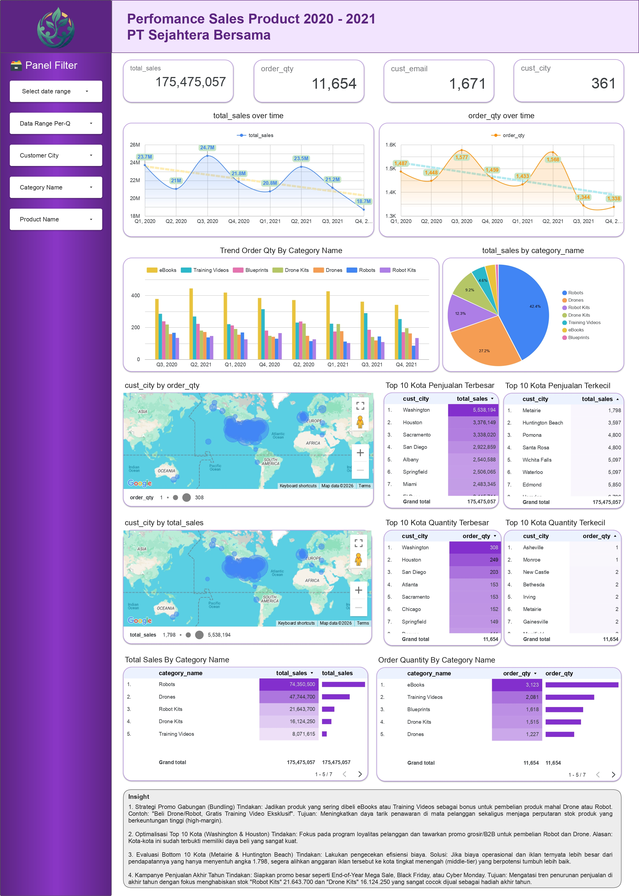

# 🏦 Virtual Internship Experience — BI Analyst Bank Muamalat (PT Sejahtera Bersama)



<br>

## 📖 1) Project Overview
This project delivers a unified analytical view of **sales performance** for PT Sejahtera Bersama across the period of **2020–2021**. As part of the Bank Muamalat Virtual Internship Experience Final Task, the solution integrates four raw tables into a curated master dataset using SQL, and publishes an **interactive dashboard** in Google Looker Studio to explore sales trends, geographical performance, and product category profitability.

## 🎯 2) Objectives & Business Questions

**Objectives**
- Define primary keys and table relationships for the raw datasets.
- Build a **single source of truth** (Master Data) using SQL `JOIN` operations.
- Surface **actionable insights** to maintain or increase sales based on historical transaction data.

**Key Questions**
- What are the **sales and order quantity trends** over time?
- Which **customer cities** outperform or lag behind in total sales and transactions?
- Which **product categories** generate the highest revenue and volume?
- What strategic promotions (e.g., bundling, targeted ads) can be implemented to boost future performance?

## 📂 3) Data Sources
The dataset consists of four raw tables related to e-commerce/retail transactions:
- `Customers` — contains customer information (`CustomerEmail`, `CustomerCity`).
- `Products` — product master (`ProductName`, `ProductPrice`).
- `Orders` — transaction records (`OrderDate`, `OrderQty`).
- `ProductCategory` — product categorization (`CategoryName`).

## 🛠️ 4) Architecture & Tech Stack
- **Data Platform / Processing**: Google BigQuery / SQL  
- **Transformations**: StandardSQL (`JOIN`, `AS`, `ORDER BY`, basic arithmetic)  
- **BI / Visualization**: Google Looker Studio  

## 🗄️ 5) Data Modeling & Core Transformations
**Integrated Master Table (`tabel_master`)**
- Defined primary keys for each table: `CustomerID`, `ProdNumber`, `OrderID`, and `CategoryID`.
- Joined **Orders ↔ Customers ↔ Products ↔ ProductCategory** to form a comprehensive Data Mart containing mandatory fields.
- Selected specific columns and renamed them using aliases (e.g., `CustomerEmail AS cust_email`, `OrderDate AS order_date`).
- Computed **total_sales** = `Quantity × Price`.
- Ordered the final dataset by **order_date** in ascending order (`ASC`) from the earliest to the latest transaction.

> 💡 **Note:** SQL scripts are placed under `/sql` (e.g., `syntax_master_data.sql`).

## 📊 6) Dashboard Features
Built in Google Looker Studio, fulfilling all mandatory challenge requirements:

**Global Filters**: Date Range, Customer City, Category Name, Product Name.

**Visualizations Included:**
- **Overview KPI**: Scorecards for Total Sales, Total Order Qty, Total Customers, and Total Cities.
- **Trend Analysis**: Line charts comparing `total_sales` and `order_qty` over time.
- **Top & Bottom Cities**: Leaderboards highlighting the Top 10 and Bottom 10 Customer Cities by Sales and Quantity.
- **Category Performance**: Pie chart and Bar charts mapping the Top Product Categories by Sales and Quantity (highlighting *Robots* and *Drones*).
- **Geographic Map**: Bubble map distribution of total profit and quantity across regions.
- **Actionable Insights**: Recommendations for Product Bundling, B2B Loyalty Programs in Top Cities, and End-of-Year Mega Sales.

## 🚀 7) How to Reproduce
1. **Database Setup**: Upload the 4 raw CSV datasets (`Customers`, `Products`, `Orders`, `ProductCategory`) into Google BigQuery.
2. **Run SQL**: Execute the transformation script provided in this repository to build the Master Data table.
3. **Export Data**: Save the result of the SQL query as a CSV file.
4. **Connect Looker Studio**: Upload the CSV file to Google Looker Studio, add filter controls, and configure the visuals as required.

## 🔗 8) Important Links
- **Looker Studio Dashboard**: (https://datastudio.google.com/reporting/0900e11c-47d7-4c14-9b90-8a7b9f309719)
- **Video Presentation**: (https://datastudio.google.com/reporting/0900e11c-47d7-4c14-9b90-8a7b9f309719)
- **Final Submission File (PDF)**: https://datastudio.google.com/reporting/0900e11c-47d7-4c14-9b90-8a7b9f309719

## 📁 9) Repository Structure
```text
.
├── assets/ 
│   ├── Dashboard_Bank_Muamalat.jpg 
│   └── Relationship_Schema.png 
├── README.md    
└── syntax_master_data.sql
